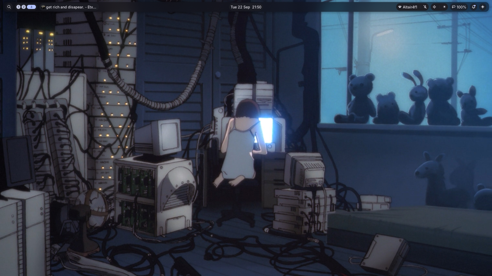

<div align="center">
  <pre>
┌───────────────────────────────┐
│  c a c h y o s . d o t s     │
└───────────────────────────────┘
  </pre>

  <p>A quiet, functional Wayland desktop built around Niri and Noctalia.</p>

  <code>CachyOS · Niri · Noctalia v5 · Ghostty · Fish</code>
  <br><br>
  <a href="#installation">install</a> ·
  <a href="#keybindings">keys</a> ·
  <a href="#layout">files</a> ·
  <a href="#troubleshooting">help</a>
</div>



> Built for **CachyOS / Arch Linux**, **Niri**, and native **Noctalia v5**. The lock-screen layout is mirrored across the 1920×1080 `eDP-1` and `HDMI-A-1` outputs.

<a id="features"></a>

## `01 / desktop`

| Area | Setup |
| --- | --- |
| Compositor | Niri with split KDL configuration |
| Shell | Native Noctalia v5 |
| Bar | Floating capsule, centered clock, media beside workspaces |
| Connectivity | Wi-Fi and Bluetooth grouped with a subtle divider |
| Levels | Volume and brightness grouped with a subtle divider |
| Lock screen | Digital clock, simple audio visualizer, compact unlock card |
| Launcher | App grid plus calculator, emoji, panels, and session providers |
| Terminal / shell | Ghostty and Fish |

Noctalia owns the bar, launcher, clipboard, notifications, lock screen, wallpaper, and connectivity UI. The standalone NetworkManager and Blueman tray applets are disabled to avoid duplicate icons.

---

<a id="layout"></a>

## `02 / files`

| Repository path | Live path |
| --- | --- |
| `niri/` | `~/.config/niri` |
| `noctalia/config.toml` | `~/.config/noctalia/config.toml` |
| `noctalia/settings.toml` | `~/.local/state/noctalia/settings.toml` |
| `autostart/*.desktop` | `~/.config/autostart/` |
| `ghostty/` | Ghostty configuration |
| `fish/` | Fish configuration |
| `cyclonedds.xml`, `fastdds_profile.xml` | ROS 2 DDS profiles |

`noctalia/settings.toml` is linked deliberately: changes made through Noctalia Settings—including the lock-screen editor—appear directly in Git. The older JSON/QML files under `noctalia/` are a legacy v4 snapshot and are not loaded by this setup.

---

<a id="installation"></a>

## `03 / install`

Install the core packages:

```bash
sudo pacman -S niri noctalia networkmanager bluez pipewire upower power-profiles-daemon
```

Clone the repository:

```bash
git clone git@github.com:Ashwani1330/dotfiles-cachyos.git ~/dev/dotfiles
cd ~/dev/dotfiles
```

Back up any existing targets, then link the tracked files:

```bash
mv ~/.config/niri ~/.config/niri.bak
mkdir -p ~/.config/noctalia ~/.local/state/noctalia ~/.config/autostart

ln -s "$PWD/niri" ~/.config/niri
ln -s "$PWD/noctalia/config.toml" ~/.config/noctalia/config.toml
ln -s "$PWD/noctalia/settings.toml" ~/.local/state/noctalia/settings.toml
ln -s "$PWD/autostart/nm-applet.desktop" ~/.config/autostart/nm-applet.desktop
ln -s "$PWD/autostart/blueman.desktop" ~/.config/autostart/blueman.desktop
```

Validate and reload:

```bash
noctalia config validate
niri validate
noctalia msg config-reload
```

---

<a id="keybindings"></a>

## `04 / keys`

| Key | Action |
| --- | --- |
| `Mod+Return` | Open Ghostty |
| `Mod+D` | Open Noctalia launcher |
| `Mod+C` | Open clipboard history |
| `Mod+N` | Open Nautilus |
| `Mod+Shift+X` | Lock session |
| `Mod+Shift+E` | Open session menu |
| `Mod+Shift+Esc` | Show Niri hotkey overlay |
| `Print` | Copy the screen to clipboard |
| `Mod+Print` | Capture the screen |

Volume, microphone, media, and brightness hardware keys call Noctalia directly and remain available on the lock screen.

---

## `05 / update`

The symlinks make the repository the live configuration. After changing Niri or Noctalia:

```bash
cd ~/dev/dotfiles
git status
git add niri noctalia autostart README.md assets
git commit -m "update desktop config"
git push
```

---

<a id="troubleshooting"></a>

## `06 / help`

<details>
<summary>Noctalia does not start after login</summary>

Confirm `niri/cfg/autostart.kdl` contains `spawn-at-startup "noctalia"` and that `noctalia --version` reports v5.
</details>

<details>
<summary>The lock-screen widgets are misplaced</summary>

The tracked geometry mirrors `eDP-1` and `HDMI-A-1` at 1920×1080. Run `noctalia msg lockscreen-widgets-edit`, reposition the widgets, and exit the editor; the linked `noctalia/settings.toml` updates automatically.
</details>

<details>
<summary>Duplicate network or Bluetooth icons appear</summary>

Check that the two files in `~/.config/autostart/` point to this repository. They hide only the GUI applets; NetworkManager and BlueZ continue running as back-end services.
</details>

<details>
<summary>Niri rejects the configuration</summary>

Run `niri validate` before reloading. The root `niri/config.kdl` includes the files under `niri/cfg/`.
</details>

---

<div align="center">
  <pre>-- eof · keep the desktop quiet --</pre>
</div>
